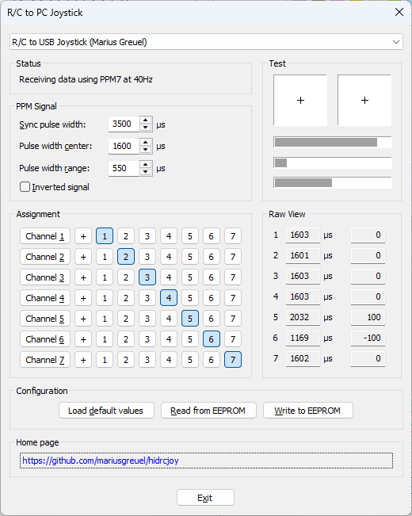

# R/C to PC Joystick

hidrcjoy is my AVR solution to convert a R/C transmitter
PPM signal to a USB HID joystick.

In addition to PPM, the software supports the Multiplex PCM and SRXL protocol.
Using a SRXL capable receiver, such as the Multiplex RX-4/16 FLEXX,
you can connect your M-Link capable receiver to your PC and
use it as a HID joystick.

## Background

Many tranmitters for radio controlled models use PPM signal coding to
transmit the position of the control sticks to the receiver.
Often, the transmitter has a connector, from which this PPM signal can be obtained.
The hidrcjoy firmware is capable of decoding the PPM signal and
converting the signals to a USB joystick using a HID device profile.
The R/C transmitter can then be used as an USB joystick on a PC,
for instance to fly a model airplane on a PC based 3D simulation.

## Features

- Decodes standard PPM signals
- Decodes Multiplex PCM signals
- Decodes Multiplex SRXL signals
- Windows application to adjust PPM timing parameters, channel mapping, and channel polarity.

## Hardware

Any Arduino-style AVR board with an **ATmega32U4** is supported, such as:

- Arduino Micro
- Arduino Leonardo
- Pro Micro
- Beetle

## Pinout

hidrcjoy uses the following pins:

- PPM/PCM signal: A0/PF7
- SRXL signal: RXD1/PD2
- LED: PC7

Board     | PPM    | SRXL  | LED
----------|--------|-------|------
Micro     | D18/A0 | D0/RX | D13
Leonardo  | D14/A0 | D0/RX | D13
Pro Micro | D18/A0 | D0/RX | D13
Beetle    | D14/A0 | D0/RX | D13

## Installing the software

You can find the latest release of the hidrcjoy software in the [Releases](https://github.com/mariusgreuel/hidrcjoy/releases).

You need two files from the release files:

- **hidrcjoy-app.zip**: The hidrcjoy Windows application
- **hidrcjoy-firmware.zip**: The firmware for your ATmega32U4 board

The `hidrcjoy.hex` firmware needs to be flashed to your ATmega32U4 board using the built-in bootloader.

If you use [AVRDUDE for Windows](https://github.com/mariusgreuel/avrdude), you can flash the software via specifing the USB VID/PID.
For instance, for a Leonardo/Beetle board, you can use the following command:

```bat
avrdude -c avr109 -p atmega32u4 -P usb:2341:0036 -D -U flash:w:hidrcjoy.hex:i
```

## Building the software

hidrcjoy consists of two parts:
The firmware for the AVR board and a Windows application to configure the firmware.

### Building the Firmware

To build the firmware, you need the **AVR8 toolchain 3.7.0.1796**, **GNU make**, and **avrdude** in your path.

On Windows, you can use set build.bat file to set the environment variables and run make:

```bat
set AVR8_GNU_TOOLCHAIN=C:\path\to\avr8-gnu-toolchain-3.7.0.1796-win32.any.x86_64
build.bat
```

### Building the Windows Application

To build the PC software, you need Visual Studio 2022. Just open the solution and hit build.

## Ready made interface

Personally, I use a [Beetle board](https://www.google.com/search?q=ATmega32U4+Beetle)
connected to a thirty year old **Multiplex Profi mc 3030** radio with a [DIN connector](https://github.com/mariusgreuel/mpx-mc3030-pinout).

**Beetle board with Multiplex DIN connector:**


Note that I soldered a GND wire to A2 to have a convenient place for the connector.

**hidrcjoy Windows application**



The astute reader might have noticed that the center pulse of my radio has a pulse length of 1.6us instead of the ususal 1.5ms.
This is what Multiplex used 30 years ago, and they switch to 1.5ms (Impulsformat UNI) in the 2000s.

The reason that the pulse length is 3us off is due to the fact that my Beetle board uses a cheap resonator instead of a crystal.
The timing of the 30 year old Multiplex radio is spot on!

## License

hidrcjoy is released under the GNU GPLv2.
